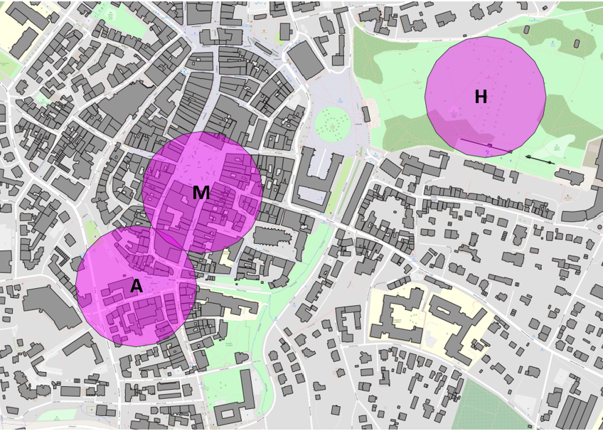

# Urban Thermal Data Analysis

## Overview

This repository presents selected results from my master's thesis project on urban thermal system behaviour using environmental and meteorological measurement data.

The project investigates the differences between urban and rural thermal conditions and explores the potential of data-driven methods for analysing and predicting urban thermal dynamics.

Due to project and data confidentiality, this repository contains selected figures, workflows and portfolio material rather than the complete dataset and source code.

---

## Research Objectives

The main objectives of the project were:

* Analyse urban and rural thermal behaviour using environmental measurements
* Investigate temporal patterns of urban thermal conditions
* Develop data-driven indicators for thermal analysis
* Evaluate machine learning methods for prediction tasks
* Assess the influence of meteorological variables on thermal behaviour

---

## Data Sources

The analysis is based on:

* Urban environmental monitoring stations
* Rural reference measurements
* Meteorological observations
* Environmental time-series data
* Spatial information processed using QGIS

---

## Methods

### Data Processing

* Data validation and quality control
* Missing data handling
* Feature engineering
* Statistical analysis
* Time-series processing
* QGIS

### Spatial Analysis

* Station mapping using QGIS
* Spatial visualization of monitoring locations
* Geographic comparison between urban and rural environments

### Machine Learning

* Random Forest
* Decision Tree
* Feature importance analysis
* Model validation and performance assessment

---

## Selected Results

Examples of outputs included in this repository:

* Environmental time-series visualisations
* Urban-rural thermal comparisons
* Feature importance analysis
* Model performance evaluation
* Spatial visualisations

Figures are available in the `figures` directory.

---
## Example Results

### Urban Morphology Analysis

Spatial analysis of urban morphology using QGIS and the Bavarian 3D Building Model. Building Coverage Ratio (BCR) was calculated to characterize urban form and support the interpretation of local thermal conditions.

  

## Tools and Software

* Python
* Pandas
* NumPy
* Scikit-learn
* Matplotlib
* Jupyter Notebook
* QGIS

---

## Key Skills Demonstrated

* Environmental data analysis
* Measurement data validation
* Time-series analysis
* Spatial analysis
* Machine learning
* Data visualisation
* Scientific reporting

---

## Author

Ali Ghamary Zamharir

M.Eng. Candidate – Analytical Measurement, Instrumentation and Sensor Technology

M.Sc. Environmental Engineering

Germany

---

## Disclaimer

This repository is intended as a professional portfolio and project summary. The complete thesis dataset and full project implementation are not publicly available due to data and project restrictions.
